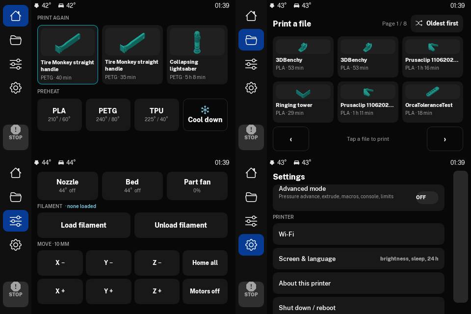

# StarStack printer UI (klipper-ui)

A consumer-friendly UI for Klipper printers, Bambu-style simple with an Advanced mode:

- **Mainsail** theme (StarStack colors, Public Sans, logo), safety settings (confirm E-stop and cancel), grouped macro buttons
- **Touchscreen** (BTT TFT35 SPI, 480×320) via the StarStack fork of KlipperScreen:
  [StarStackCo/KlipperScreen-starstack](https://github.com/StarStackCo/KlipperScreen-starstack)
- **Macros** behind the buttons: speed presets, flow (40–120%), preheat, guided filament load/unload with a
  remembered material, color change (`M600`), runout



Built for the **StarStack S1**: BTT Pi (CB1), BTT TFT35 SPI, Mellow FLY Micro4, cantilevered bed-slinger
(180 × 180 × 165 mm) with an E3D PZ probe, E3D Revo Voron and Galileo 2 extruder. Its `printer.cfg` is in
[`config/s1/`](config/s1/) (see [`config/README.md`](config/README.md), also for board firmware updates).
The UI works on any Klipper + Moonraker + Mainsail + KlipperScreen setup.

On the S1, Mainsail is at **http://starstack-s1.local** (or the printer's IP address).

## Install on a printer

On the printer's Pi (SSH, as the normal user). Klipper, Moonraker, Mainsail and KlipperScreen must already
be installed (e.g. with KIAUH). Do this when the printer is idle.

```bash
git clone https://github.com/StarStackCo/klipper-ui.git ~/klipper-ui
bash ~/klipper-ui/install.sh --dry-run      # see what it will change
bash ~/klipper-ui/install.sh                # install
```

The installer:
1. links `starstack_macros.cfg` and the Mainsail `.theme` from `~/klipper-ui` into your config folder
2. checks `printer.cfg` has `[include starstack_macros.cfg]`, `[save_variables]`, `[exclude_object]` and
   `[include mainsail.cfg]` (add `--fix-printer-cfg` to let it add them)
3. adds `[update_manager klipper-ui]` and points `[update_manager KlipperScreen]` at the StarStack fork
4. switches KlipperScreen to the StarStack fork, installs the Public Sans font, selects the `starstack` theme
5. applies the Mainsail settings, macro groups and dashboard panel order
6. sets up the **USB stick import** (asks for your password once; skip with `--no-usb`): plugging a stick
   in copies new G-code files, folders included, into the print jobs folder and the touchscreen offers to
   print the newest one. The stick is mounted read-only and unmounted after copying, so it can be pulled
   out right away
7. sets up the **StarStack boot screen** (asks for your password; skip with `--no-splash`): the logo
   shows on the touchscreen from power-up until the UI starts, at shutdown and while the UI restarts.
   A progress bar fills while it starts, and if the touchscreen app ever fails to start the screen says so
   and shows the Mainsail address. Boot text goes to the serial port only. Takes effect after a reboot
8. makes it **boot faster** (asks for your password; skip with `--no-fastboot`): Klipper, Moonraker and the
   touchscreen start without waiting for the network, unused services (webcam streamer, OpenVPN, NFS,
   console setup) and automatic OS updates are switched off, and the touchscreen skips OpenGL.
   `--uninstall` turns them back on. Update the OS from Mainsail's Update Manager instead
9. restarts Moonraker, Klipper and KlipperScreen

Every file it changes is backed up once as `<file>.pre-starstack`.

**OrcaSlicer:** turn on *Label objects* (cancel object), thumbnails `48x48/PNG, 300x300/PNG`, and set
*Change filament G-code* to `M600` for color changes (the S1 config also accepts `CHANGE_FILAMENT`).

## Update

Mainsail › **Machine › Update Manager**: update **klipper-ui** (macros + theme) and **KlipperScreen**
(touchscreen). Printers follow the stable branches (`main` here, `starstack` in the fork).

## Uninstall

```bash
bash ~/klipper-ui/install.sh --uninstall
```
Restores the backed-up files, stock KlipperScreen and Mainsail defaults. Lines added to `printer.cfg`
are left for you to remove.

## Safety

- Macros never change Klipper's limits (max temp, min extrude temp, thermal protection, endstops) and never
  block waiting for heat. Checked by CI (`tools/check_macros.py`) and in `docs/macro-safety-review.md`.
- The touchscreen STOP button is always on screen, red whenever the printer is active.
- **Shut the Pi down before unplugging it** (touchscreen Settings › Shut down, or Mainsail's power menu).
  Pulling the power while it runs can corrupt the SD card.

## Development

| Branch | Purpose |
|---|---|
| `dev` | Work happens here. Bench-test with `scripts/pi-install.sh --branch dev` / `scripts/ks-update.sh --branch dev` |
| `main` | Stable, what printers install. Updated only by pull request from `dev` after the bench checklist (`docs/test-checklist.md`) |

From a PC with SSH access to the bench Pi (`scripts/pi.sh` logs every command to `logs/`):

| Script | What |
|---|---|
| `scripts/pi-install.sh [--branch dev] [--dry-run]` | Update `~/klipper-ui` on the Pi and run the installer |
| `scripts/ks-update.sh [--branch dev] [shot.png]` | Push the touchscreen fork branch, update the Pi, restart, screenshot |
| `scripts/ks-screenshot.sh shot.png` | Capture the touchscreen |
| `scripts/ks-tap.sh "click Settings" [shot.png]` | Drive the touchscreen (needs bench devtools: `touch ~/.starstack_dev`, off on the S1) |
| `scripts/bench_test_macros.py` | Automated macro tests (bench config only) |
| `scripts/make_bench_print.py` | Demo print with thumbnail, objects, layers, color changes |

Layout:

| Folder | What |
|---|---|
| `macros/` | Klipper macros behind the buttons |
| `mainsail-theme/` | Mainsail theme + settings |
| `config/` | `s1/` the S1's printer.cfg (+ reference moonraker.conf), `bench/` bench-only printer.cfg (fake heaters, never for a real printer) |
| `splash/` | Boot screen: logo images, progress bar + "app didn't start" watchdog, systemd units |
| `boot/` | Faster-boot changes (systemd edit, X config) |
| `usb/` | USB stick import (udev rule, service, script) |
| `tools/` | Installer helpers, image generator, CI checks |
| `scripts/` | PC-side bench tools (SSH, screenshots, macro tests) |
| `design/` | Designs and screenshots |
| `docs/` | [Plan](docs/PLAN.md), [decisions log](docs/DECISIONS.md), [requirements](docs/requirements.md), [test checklist](docs/test-checklist.md), [macro safety review](docs/macro-safety-review.md), [backlog](docs/BACKLOG.md) |

## License

Code, configs and docs: **GPL-3.0** (`LICENSE`). The StarStack name and logos are trademarks and are not
covered by the license (`TRADEMARKS.md`).
